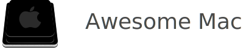
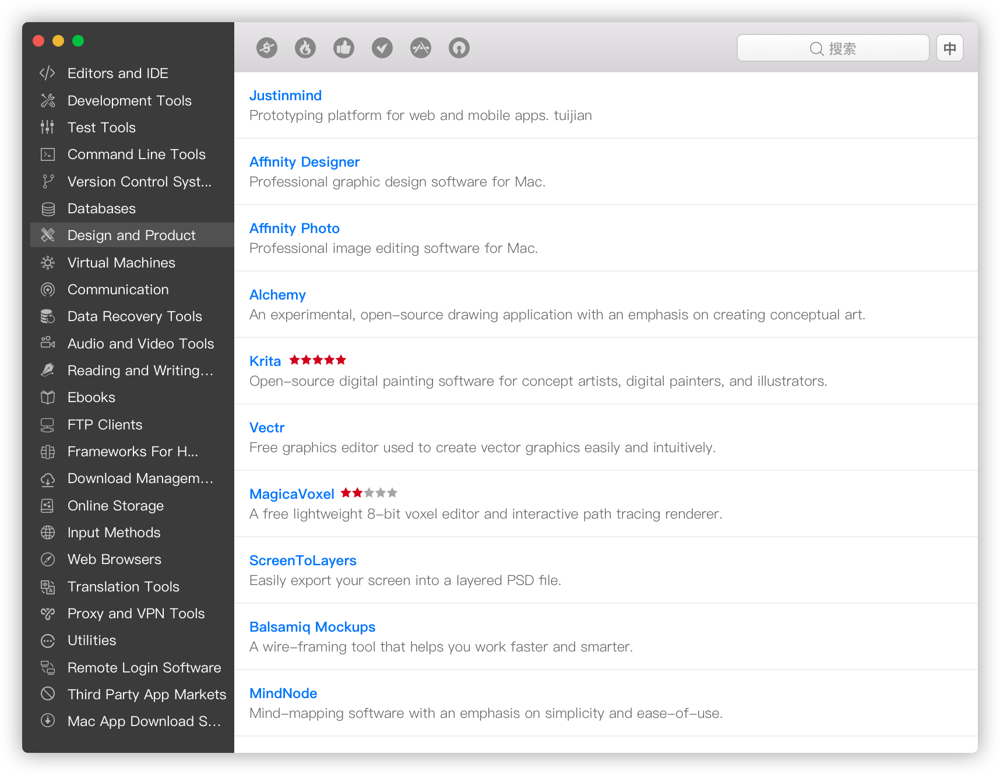

# Awesome Mac App

[](https://github.com/jaywcjlove/amac)

## Screenshots



## Development

To develop, run the self-reloading build:

Get the code

```bash
$ git clone https://github.com/jaywcjlove/amac.git
$ cd amac
$ npm install # or  yarn install
```

To develop, run the self-reloading build:

```bash
# Run the app
$ npm run app

# Restart the app automatically every time code changes. 
# Useful during development.
$ npm run dev
$ npm run app:dev
```

`npm run dev` will live-reload the frontend so you don't need to refresh. If you change main.js however, you'll have to restart electron to reload your changes.

## Package the app

Builds app binaries for Mac.

```bash
$ npm run package
```

## License

Licensed under the [MIT](./LICENSE) License.